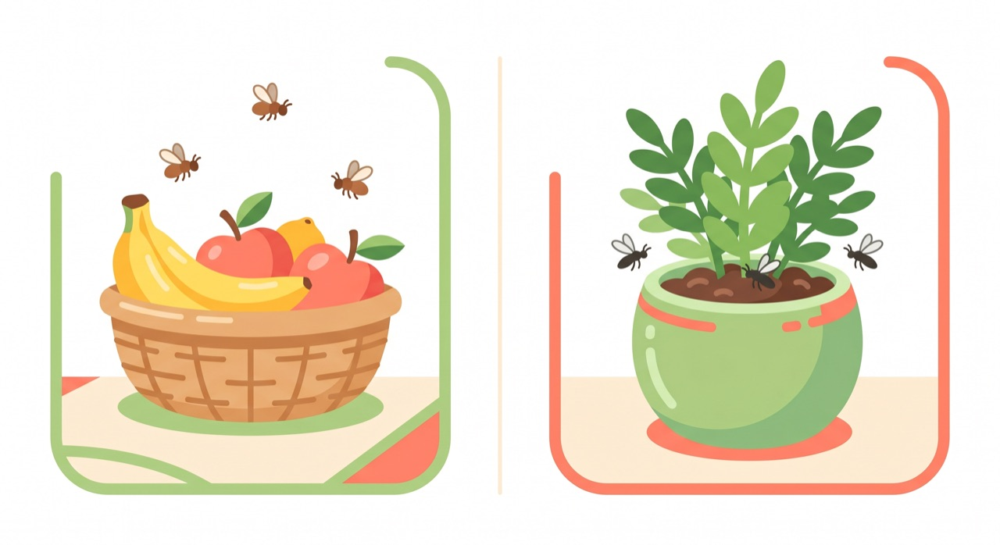
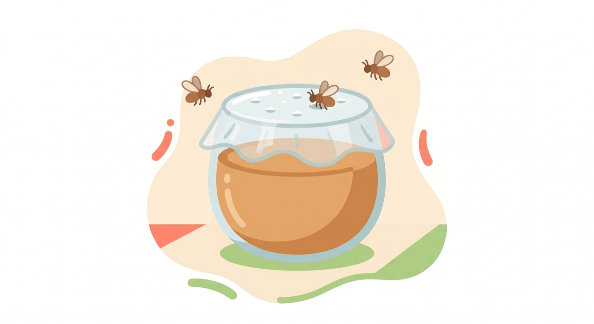
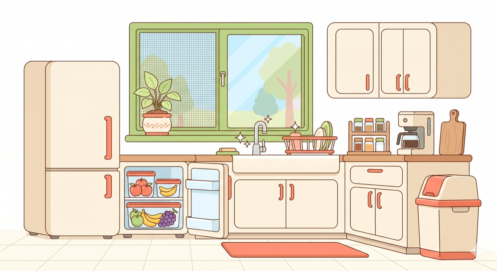

작성일: 2026-06-16

---

---

## 초파리 vs 날파리, 뭐가 다를까?

- **초파리(Fruit Fly)**: 과일·음식물 쓰레기에 꼬이는 작은 갈색 파리. 눈이 빨간 것이 특징.
- **날파리(Fungus Gnat)**: 과습한 화분 흙에서 번식하는 검은 작은 파리.

원인이 다르기 때문에 제거 방법도 다르다.

---

## 초파리 없애기

### 원인 차단 (가장 중요)

- 과일·채소를 실온에 오래 두지 않는다. 여름엔 냉장 보관.
- 음식물 쓰레기통은 뚜껑이 있는 것을 사용하고, 매일 비운다.
- 설거지를 바로바로 한다. 싱크대에 음식 찌꺼기를 남기지 않는다.
- 배수구에 음식물이 쌓이지 않도록 주기적으로 청소한다.

### 트랩으로 잡기

**식초 트랩** (가장 간단)
1. 컵에 사과식초 + 세제 몇 방울을 넣는다.
2. 랩으로 덮고 이쑤시개로 구멍을 뚫는다.
3. 식초 냄새에 유인된 초파리가 세제 때문에 익사한다.

**와인/맥주 트랩**
- 다 마신 와인병이나 맥주캔을 그대로 두면 자연스럽게 트랩이 된다.

**시중 트랩**
- 컴배트·홈매트 등 시중 초파리 트랩도 효과적.

### 번식지 제거

- 배수구에 끓는 물을 붓거나 베이킹소다 + 식초를 부어 거품으로 청소한다.
- 빈 병, 캔은 바로 씻거나 버린다.

---

## 날파리 없애기 (화분 파리)

### 원인 차단

- 화분에 **과습**이 가장 큰 원인. 흙 표면이 완전히 마른 후에 물을 준다.
- 흙 위에 모래·자갈·마사토를 1~2cm 덮으면 알 낳는 것을 방지할 수 있다.

### 트랩으로 잡기

- **노란 끈끈이 트랩**: 화분 옆에 꽂아두면 성충이 달라붙는다.
- 집에 있는 것으로 빠르게: 노란 포스트잇에 식용유나 올리브유를 발라두면 임시 트랩으로 사용 가능.

### 흙 속 유충 제거

- **목초액** 희석 (물 500ml당 1~2ml)해서 물을 주면 유충 사멸 효과.
- **바크(bark) 멀칭** 또는 마사토 복토로 환경 자체를 건조하게 유지.
- 심각할 경우 흙을 통째로 교체하는 것이 가장 확실하다.

---

## 공통 예방 수칙

| 장소 | 핵심 수칙 |
|------|----------|
| 주방 | 음식물 즉시 처리, 싱크대 배수구 청결 |
| 거실 | 과일 냉장 보관, 음료컵 바로 씻기 |
| 화분 | 과습 금지, 흙 표면 건조 유지 |
| 공통 | 창문 방충망 점검 |

---

## 요약

> 초파리는 **음식물 관리**, 날파리는 **흙 과습 방지**가 핵심.  
> 트랩은 보조 수단 — 원인을 차단하지 않으면 계속 생긴다.
