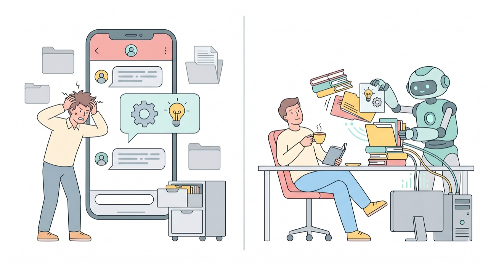

`📍 part0 > 챗GPT·클로드 앱이랑 뭐가 다른가요?`

> **같은 일을 시켜보면 차이가 확 드러납니다.** 챗GPT는 '답'을 주고, 클로드코드는 '결과물'을 줍니다. 이번 글에서 그 경계를 손에 잡히게 정리합니다.

---

앞 글([클로드코드가 뭔가요?](part0-1.클로드코드가-뭔가요))에서 *"말로 답하는 AI vs 직접 행동하는 AI"* 라는 큰 차이를 봤습니다. 이번엔 **같은 부탁을 했을 때 실제로 무엇이 다른지** 나란히 놓고 보겠습니다.

---

## 같은 부탁, 다른 결과

상황을 하나 가정해볼게요. 내 컴퓨터의 한 폴더에 **엑셀 파일 3개**가 있고, 이걸 하나로 합쳐 정리하고 싶습니다.

**챗GPT(또는 클로드 앱)에게 부탁하면**
- *"이렇게 하시면 됩니다"* 하고 **방법을 친절히 설명**해 줍니다.
- 파일을 직접 올리면 내용을 읽고 분석도 해주지만, **내 컴퓨터 폴더 안의 파일을 직접 열거나 새 파일로 저장하지는 못합니다.** 대화창은 내 컴퓨터와 분리된 공간이거든요.

**클로드코드에게 부탁하면**
- 내 폴더에 있는 **그 엑셀 3개를 실제로 열어** 내용을 합치고,
- **정리된 새 엑셀 파일을 그 폴더에 직접 만들어** 둡니다.

설명을 듣고 내가 마무리하느냐, 결과 파일을 받느냐 — 여기서 갈립니다.

---

## 핵심 차이 3가지

| 구분 | 챗GPT·클로드 앱 (챗봇) | 클로드코드 (AI 에이전트) |
|------|----------------------|------------------------|
| **① 내 컴퓨터 접근** | 분리된 대화창. 내 폴더·파일에 손 못 댐 | **내 작업 폴더**의 파일을 직접 읽고·쓰고·고침 |
| **② 일하는 방식** | 한 번 묻고 한 번 답 | 읽기→처리→저장을 **여러 단계 알아서** 연속 수행 |
| **③ 결과물 형태** | 화면에 뜨는 **텍스트 답변** | 실제 **파일·변경된 결과물** |

이 세 가지는 결국 1편에서 말한 **'챗봇 vs 에이전트'** 의 구체적인 모습입니다. 같은 'AI 두뇌'를 쓰지만, 클로드코드는 *손과 작업대(내 폴더)* 를 하나 더 가진 셈이죠.

---

## 그럼 챗GPT는 이제 필요 없나요?

전혀요. **각자 더 잘하는 자리가 다릅니다.** 둘은 경쟁이 아니라 역할 분담에 가깝습니다.

**챗GPT·클로드 앱이 더 편한 때**
- 가벼운 질문, 아이디어 브레인스토밍, 글 다듬기
- 그림 그리기(이미지 생성) 같은 작업
- 폰을 들고 **이동 중에 빠르게** 물어볼 때

**클로드코드가 빛나는 때**
- 내 **파일·폴더를 실제로 만지는** 모든 일 (정리·변환·생성)
- 여러 파일을 **한 번에**, 또는 **반복 작업**을 맡길 때
- 자료를 찾아 **내 문서로 정리**해 저장까지 해야 할 때

> 💡 쉽게 기억하기: **떠오르는 걸 물어볼 땐 챗GPT, 내 컴퓨터에서 뭔가 만들어내야 할 땐 클로드코드.**

---

## 오늘의 핵심 한 줄

> **챗GPT는 '답'을 주고, 클로드코드는 '결과물(파일)'을 준다.**
> 내 컴퓨터 안에서 손을 움직여야 하는 일일수록 클로드코드의 차례입니다.

여기까지 오면 한 가지 벽이 남습니다. 바로 **"그 까만 터미널 화면"**. 다음 글에서 이 두려움부터 가볍게 풀고 가겠습니다.

---

◀ 이전 [클로드코드가 뭔가요?](part0-1.클로드코드가-뭔가요) · [📑 목차](0.목차) · 다음 ['터미널' 두려움 깨기](part0-3.터미널-두려움-깨기) ▶
