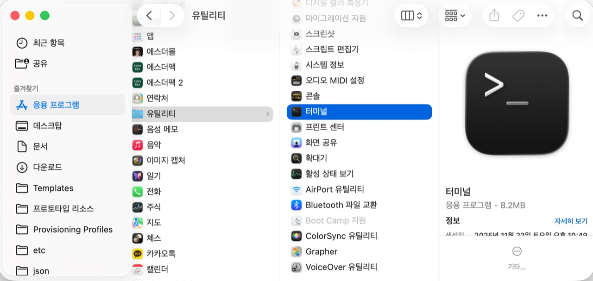
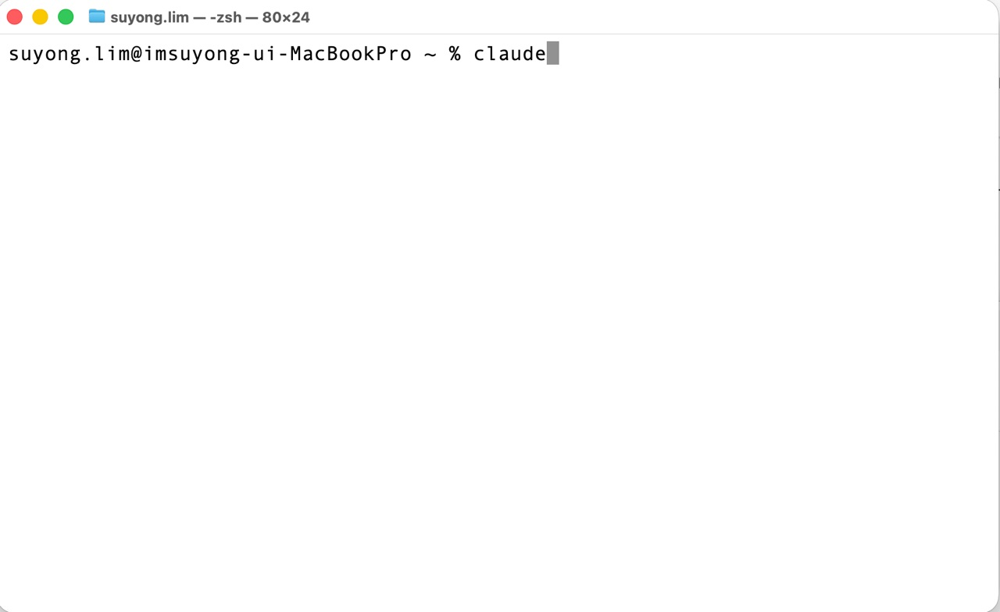
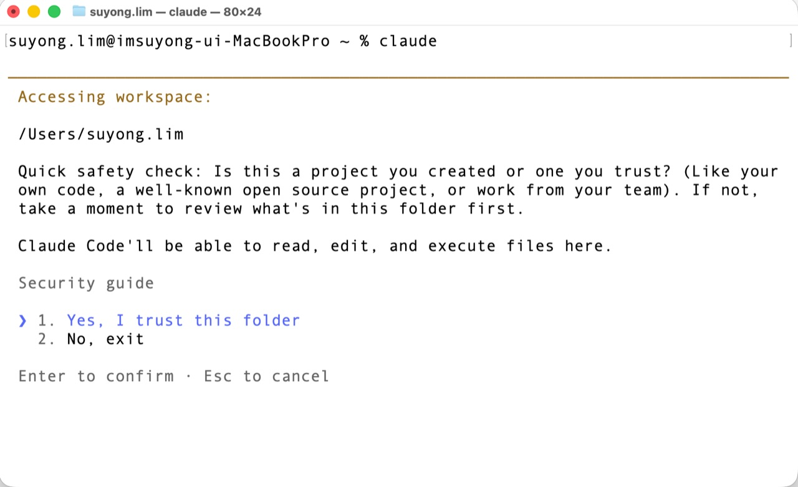
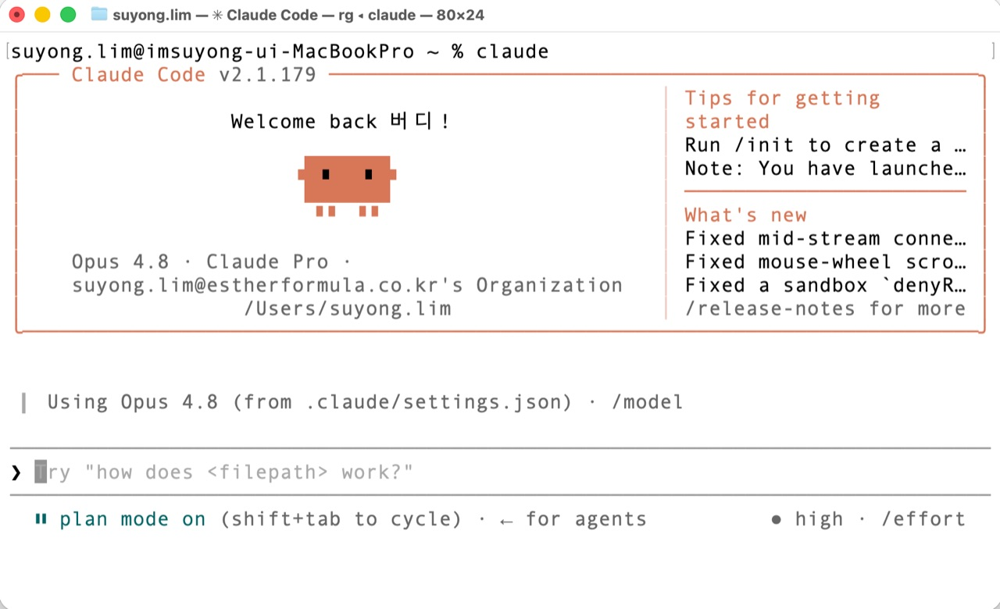

`📍 part1 > 설치하기`

> **딱 세 단계입니다.** 터미널 열기 → 설치 명령 한 줄 붙여넣기 → 로그인. 따라만 오시면 됩니다.

---

마음의 준비(파트 0)는 끝났으니, 이제 진짜로 설치해봅니다. 겁먹지 마세요. 우리가 할 일은 **명령어를 외우는 게 아니라, 안내된 한 줄을 복사해 붙여넣는 것** 뿐입니다.

## 준비물

- **Claude 계정** — 클로드코드는 Anthropic의 Claude 구독(예: Pro/Max)이나 API로 동작합니다. 없다면 먼저 [claude.ai](https://claude.ai)에서 가입해두세요.
- **인터넷 연결**, 그리고 약간의 용기 🙂

---

## 1단계 — 터미널 열기

앞 글에서 배운 그 '대화창'을 엽니다.

- **Mac**: `Cmd + 스페이스`(스포트라이트)를 누르고 **"터미널"** 이라고 입력 → 엔터
- **Windows**: 시작 버튼 옆 검색창에 **"PowerShell"** 입력 → 엔터

까만(또는 흰) 창이 뜨면 성공입니다.



> 💡 Mac은 `응용 프로그램 > 유틸리티 > 터미널`에서도 찾을 수 있어요(위 화면). 스포트라이트가 더 빠릅니다.

---

## 2단계 — 설치 명령 붙여넣기

아래는 **공식 설치 안내**입니다. 최신 명령은 항상 [공식 문서](https://docs.claude.com/en/docs/claude-code)에서 확인하세요. 보통은 안내된 **한 줄을 복사 → 터미널에 붙여넣기 → 엔터** 면 끝입니다.

- **Mac / Linux**
  ```bash
  curl -fsSL https://claude.ai/install.sh | bash
  ```
- **Windows (PowerShell)**
  ```powershell
  irm https://claude.ai/install.ps1 | iex
  ```

> 💡 붙여넣기 단축키: Mac은 `Cmd + V`, Windows PowerShell은 마우스 오른쪽 클릭. 설치가 끝날 때까지 1~2분 기다리면 됩니다.

---

## 3단계 — 실행하고 첫 화면 만나기

설치가 끝나면 터미널에 이렇게 입력하고 엔터를 누릅니다.



처음 실행하면 **로그인 안내**가 나올 수 있어요. 화면 지시를 따라 브라우저에서 Claude 계정으로 로그인하면 연결됩니다.

그다음, 클로드코드가 **"이 폴더에서 작업해도 될까요?"** 하고 한 번 물어봅니다. 내가 아는 안전한 폴더라면 **`1. Yes, I trust this folder`** 를 고르고 엔터를 누르세요.



> 💡 이 "신뢰 확인"이 바로 클로드코드의 안전장치 중 하나예요. 이 개념은 [작업 폴더](part1-3.작업-폴더)와 [권한과 안전장치](part1-4.권한과-안전장치) 글에서 더 자세히 다룹니다.

이렇게 환영 화면이 뜨면 설치 완료입니다. 🎉



---

## 잘 안 될 때

- **"command not found" 같은 메시지** → 터미널을 완전히 껐다가 다시 열고 `claude`를 다시 입력해보세요.
- 그래도 안 되면 [공식 설치 문서](https://docs.claude.com/en/docs/claude-code)의 안내를 따라 하거나, 메시지를 그대로 복사해 검색하면 대부분 해결됩니다.

---

## 오늘의 핵심 한 줄

> **터미널 열기 → 안내된 한 줄 붙여넣기 → 로그인.** 설치는 이게 전부입니다.

설치가 끝났다면, 다음 글에서 클로드코드와 **첫 대화**를 나눠봅시다.

---

<sub>◀ 이전 [비개발자가 할 수 있는 일 20가지](part0-4.비개발자가-할-수-있는-일-20가지) · [📑 목차](0.목차) · 다음 [첫 대화 — "안녕"부터 시작](part1-2.첫-대화) ▶</sub>
