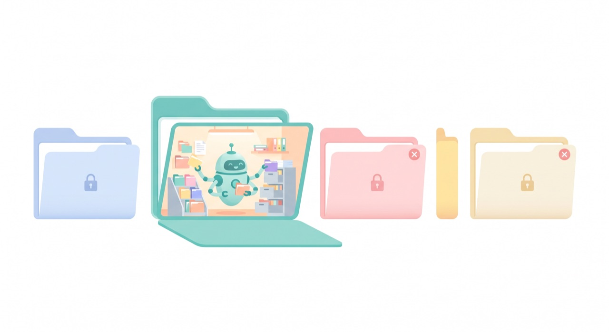

`📍 part1 > 가장 중요한 개념: 작업 폴더`

> **이 한 가지만 이해하면 클로드코드의 절반은 끝납니다.** 클로드코드는 '지금 있는 폴더'를 봅니다 — 그게 전부이자 핵심이에요.

---

비개발자가 클로드코드를 쓰면서 가장 많이 헷갈리는 단 하나를 꼽으라면, 바로 **작업 폴더(working directory)** 입니다. 반대로 말하면, 이것만 이해하면 대부분의 혼란이 사라져요.

## 핵심: 클로드코드는 '지금 있는 폴더'를 본다

클로드코드를 실행하면, 그 순간 **터미널이 위치한 폴더**가 클로드코드의 작업 공간이 됩니다. 클로드코드는 기본적으로 **그 폴더 안의 파일들만** 보고, 만지고, 새로 만듭니다.

비유하자면 이래요. 클로드코드는 유능한 비서인데, 우리가 그를 **특정 '방'(폴더)에 들여보내는** 겁니다. 그 비서는 자기가 들어간 방 안의 물건만 정리할 수 있어요. 거실에 들여보내면 거실을, 서재에 들여보내면 서재를 정리하는 거죠.

## 왜 이게 중요할까요?

- **엉뚱한 폴더에서 실행하면** → 클로드코드는 엉뚱한 파일들을 보게 됩니다. "내 보고서가 안 보인다"는 대부분 *그 보고서가 없는 폴더에서 실행*했기 때문이에요.
- **원하는 작업은** → 그 파일들이 들어 있는 **바로 그 폴더에서 클로드코드를 실행**하면 됩니다.

즉, "무엇을 시킬까"보다 먼저 **"어느 폴더에서 시작할까"** 를 챙기는 게 첫 단추입니다.

## 작업 폴더로 들어가는 가장 쉬운 방법

명령어로 폴더를 이동(`cd`)할 수도 있지만, 비개발자에겐 더 쉬운 길이 있습니다.

- **Mac**: Finder에서 원하는 폴더를 찾아 **마우스 오른쪽 클릭 → "폴더에서 새로운 터미널 열기"**. 그러면 그 폴더가 작업 폴더인 채로 터미널이 열립니다. 거기서 `claude` 실행.
  - (또는 터미널에 `cd ` 를 입력하고 폴더를 터미널 창으로 **드래그**한 뒤 엔터.)
- **Windows**: 파일 탐색기에서 폴더를 연 뒤, 주소창에 **`powershell`** 이라고 입력하고 엔터. 그 폴더에서 PowerShell이 열립니다. 거기서 `claude` 실행.

## 확인하는 습관

작업을 시작하기 전에 클로드코드에게 이렇게 물어보면 안전합니다.

> *지금 이 폴더에 어떤 파일들이 있어?*

목록을 보고 내가 원하는 파일들이 맞는지 확인한 뒤 일을 시키면, 엉뚱한 곳에서 작업하는 실수를 막을 수 있어요.

---

## 오늘의 핵심 한 줄

> **클로드코드는 '실행한 그 폴더'를 작업대로 삼는다. 일을 시키기 전, 올바른 폴더에서 시작했는지부터 확인하자.**

이제 마지막으로, 클로드코드가 "이거 해도 될까요?" 하고 물어보는 **권한과 안전장치**를 알아보겠습니다.

---

◀ 이전 [첫 대화](part1-2.첫-대화) · [📑 목차](0.목차) · 다음 [권한과 안전장치](part1-4.권한과-안전장치) ▶
