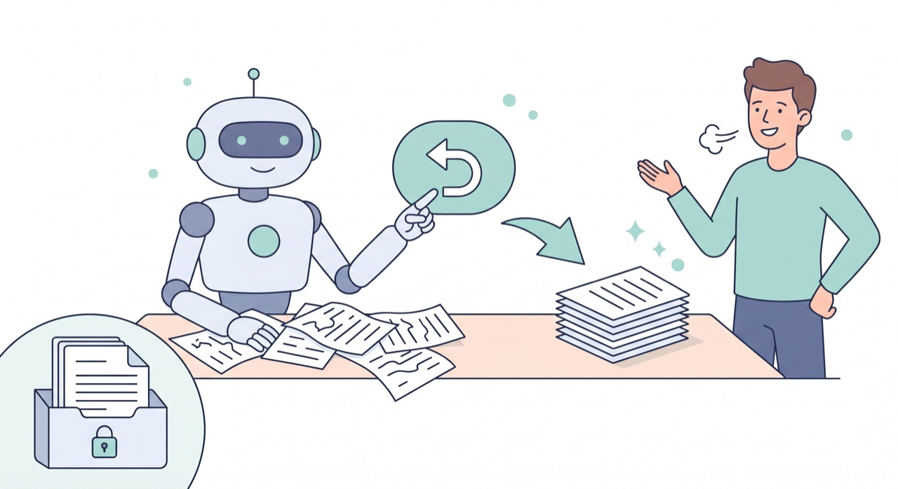

`📍 part2 > 실수했을 때 되돌리기`

> **되돌릴 수 있으면 두렵지 않습니다.** 잘못된 변경을 되돌리는 법과, 애초에 안전하게 쓰는 습관을 익히면 마음 놓고 이것저것 시켜볼 수 있어요.

---

새로운 도구를 쓸 때 가장 큰 걱정은 "내가 뭔가 망치면 어쩌지?"입니다. 좋은 소식은, 클로드코드 작업은 **대부분 되돌릴 수 있다**는 거예요. 핵심은 두 가지 — *되돌리는 법*과 *미리 대비하는 습관*입니다.

## 방금 한 작업 되돌리기

클로드코드가 방금 바꾼 내용이 마음에 안 들면, 그냥 말하면 됩니다.

> *방금 바꾼 거 되돌려줘.*
> *방금 만든 파일 지워줘.*

클로드코드는 자기가 한 작업을 알고 있어서, 직전 변경을 되돌리거나 만든 파일을 정리해줍니다.

## 더 든든한 대비 — 미리 사본 떠두기

되돌리기보다 더 확실한 건 **미리 백업해두는 습관**입니다. 중요한 파일이라면 작업 전에:

- 파일을 **복사해 사본을 하나 만들어두기** (예: `보고서.docx` → `보고서_원본.docx`)
- 또는 클로드코드에게 부탁하기: *작업하기 전에 "보고서.txt"를 "보고서_백업.txt"로 복사해줘.*

원본이 따로 있으면, 무슨 일이 생겨도 처음으로 돌아갈 수 있습니다.

## 침착함을 위한 3가지 안전망

1. **허락 단계에서 거르기** — [권한과 안전장치](part1-4.권한과-안전장치)에서 봤듯, 모르는 작업은 그 자리에서 거절하면 됩니다.
2. **작은 폴더에서 작업하기** — [작업 폴더](part1-3.작업-폴더)를 좁게 잡으면, 영향 범위 자체가 작아집니다.
3. **작게 시키고 확인하기** — 한 번에 큰 변경을 피하면 되돌릴 일도 줄어듭니다.

## 그래도 막막하면

당황하지 말고 클로드코드에게 상황을 설명하세요.

> *방금 작업하다 꼬인 것 같아. 지금 상태를 확인하고, 어떻게 되돌릴 수 있는지 알려줘.*

대부분의 경우, 함께 차근차근 정리하면 복구할 수 있습니다.

---

## 오늘의 핵심 한 줄

> **"되돌려줘" 한마디 + 미리 사본 떠두기.** 이 둘이면 실수가 두렵지 않다.

축하합니다 🎉 여기까지 오셨다면 클로드코드의 **기본기(요청·파일다루기·다듬기·되돌리기)** 를 모두 갖추신 거예요. 다음 파트(part3)부터는 드디어 이 기본기로 **일상과 업무의 진짜 일들**을 하나씩 해결해봅니다.

---

◀ 이전 [결과 확인하고 다시 시키기](part2-3.결과-확인하고-다시-시키기) · [📑 목차](0.목차) · 다음 [문서 요약·정리](part3-1.문서-요약-정리) ▶
