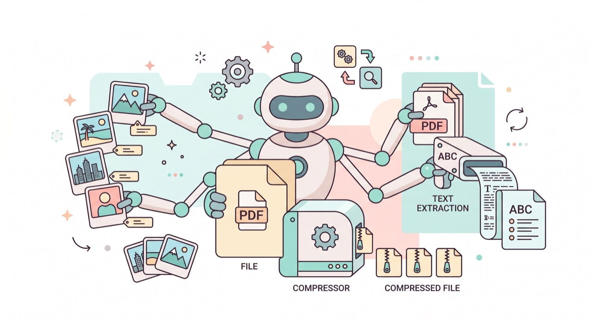

`📍 part3 > 이미지·PDF 다루기`

> **사진과 PDF도 클로드코드의 일감입니다.** 이름 바꾸기, 형식 변환, 용량 줄이기, 그리고 PDF에서 내용 뽑아내기까지 — 손이 많이 가던 일을 한 번에.

---

글뿐 아니라 **이미지와 PDF 파일**도 클로드코드로 다룰 수 있습니다. 평소 하나하나 손으로 하던 귀찮은 작업들을 맡겨보세요.

## 이미지 다루기

[사진이 든 폴더에서 실행](part1-3.작업-폴더)한 뒤 부탁합니다.

- **이름 일괄 변경**
  > *이 폴더 사진들 이름을 "여행_01, 여행_02 …" 식으로 번호를 붙여 바꿔줘.*
- **형식 변환**
  > *이 폴더의 PNG 파일들을 전부 JPG로 바꿔줘.*
- **용량 줄이기 / 크기 조정**
  > *이 사진들을 가로 1000픽셀로 줄여서 "작게" 폴더에 저장해줘.*

> 💡 사실 이 블로그의 삽화들도 클로드코드가 똑같은 방식으로 JPG 변환·용량 축소를 해서 올린 것들이에요. 😊

## PDF 다루기

PDF는 열어서 내용을 읽고 활용하는 게 핵심입니다.

- **내용 뽑아내기·요약** ([문서 요약](part3-1.문서-요약-정리)과 연결)
  > *"안내서.pdf"의 내용을 텍스트로 뽑아서 "안내서.md"로 정리해줘.*
- **필요한 부분만**
  > *이 PDF에서 '환불 규정' 부분만 찾아서 쉽게 설명해줘.*
- **표 데이터 꺼내기**
  > *이 PDF 안의 표를 엑셀에서 열 수 있게 CSV로 만들어줘.*

## 꼭 기억할 점

- **원본은 따로 보관** — 변환·리사이즈는 [되돌리기](part2-4.되돌리기)가 어려울 수 있으니, 새 폴더에 저장하도록 시키면 안전합니다.
  > *원본은 그대로 두고, 변환한 파일은 "변환본" 폴더에 넣어줘.*
- **무엇이 만들어졌는지 확인** — 작업 후 결과 폴더를 열어 눈으로 확인하세요.

---

## 오늘의 핵심 한 줄

> **사진 이름·형식·용량 정리, PDF 내용 추출 — 손 많이 가던 파일 작업을 한 번에 맡기자.**

다음 글에서는 이런 작업들을 **매번 반복하지 않게** 만드는 법을 봅니다.

---

◀ 이전 [자료조사 → 한 문서로 정리](part3-3.자료조사-정리) · [📑 목차](0.목차) · 다음 [반복 작업 자동화](part3-5.반복작업-자동화) ▶
