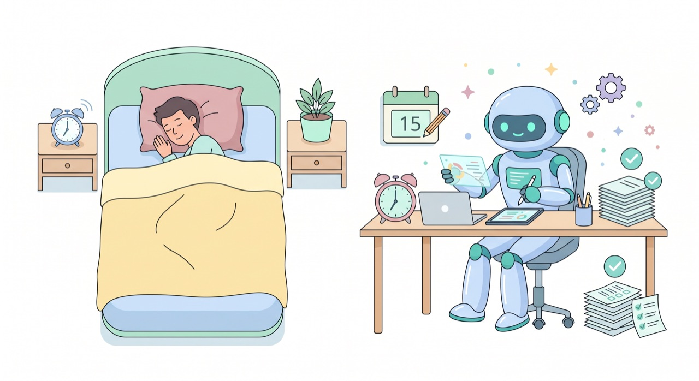

`📍 part4 > 예약·자동 실행`

> **내가 잠든 사이에도 일하는 비서.** 정해진 시간에 알아서 작업을 실행하게 해두면, 손도 대지 않고 결과만 받아볼 수 있습니다.

---

[스킬](part4-2.스킬-단축명령)로 작업을 한 단어로 줄였다면, 마지막 단계는 그 단어조차 누르지 않는 거예요. 바로 **예약·자동 실행**입니다. "매주 월요일 아침에 자동으로" 같은 약속을 걸어두는 거죠.

## 어떤 일을 할 수 있나요?

- **매일 아침** → 관심 분야 뉴스를 모아 요약 브리핑 만들기
- **매주 월요일** → 지난주 기록을 주간보고로 정리
- **매달 1일** → 지난달 지출을 표로 결산

내가 버튼을 누르지 않아도, 정해둔 시간에 클로드코드가 **알아서 실행하고 결과 파일을 만들어** 둡니다.

## 거는 법

역시 말로 부탁하면 됩니다.

> *매주 월요일 오전 9시에, 지난주 회의록을 주간보고로 정리하는 작업을 자동으로 실행되게 예약해줘.*

클로드코드가 예약을 설정해주고, 그 시간이 되면 자동으로 작동합니다.

## 자동 실행, 이것만 주의하세요

자동화는 편리한 만큼 신중함도 필요해요.

- **'읽고 정리하는' 안전한 작업부터** — 자동으로 *지우거나 덮어쓰는* 작업은 피하고, 모으고·요약하는 일 위주로 시작하세요.
- **결과를 가끔 확인** — 자동이라도 가끔 결과물을 들여다봐야, 엉뚱하게 쌓이는 걸 막을 수 있어요.
- **[권한·안전](part1-4.권한과-안전장치) 원칙은 그대로** — 위험한 작업은 자동화하지 않는 게 안전합니다.

> 💡 처음엔 "매일 아침 뉴스 요약"처럼 **결과가 쌓여도 부담 없는 작업**으로 자동화를 연습해보세요.

---

## 오늘의 핵심 한 줄

> **반복+안전한 작업은 예약해두자. 단, 지우는 작업은 자동화하지 말 것.**

축하합니다 🎉 여기까지 오셨다면 클로드코드를 **나에게 꼭 맞게 길들이는** 법까지 익히신 거예요. 마지막 파트(part5)에서는 이 모든 걸 **오래도록 안전하고 똑똑하게** 쓰는 습관을 정리합니다.

---

◀ 이전 [외부 연결 (MCP) 맛보기](part4-4.외부연결-mcp) · [📑 목차](0.목차) · 다음 [안전하게 쓰기 — 꼭 알아야 할 주의점](part5-1.안전하게-쓰기) ▶
