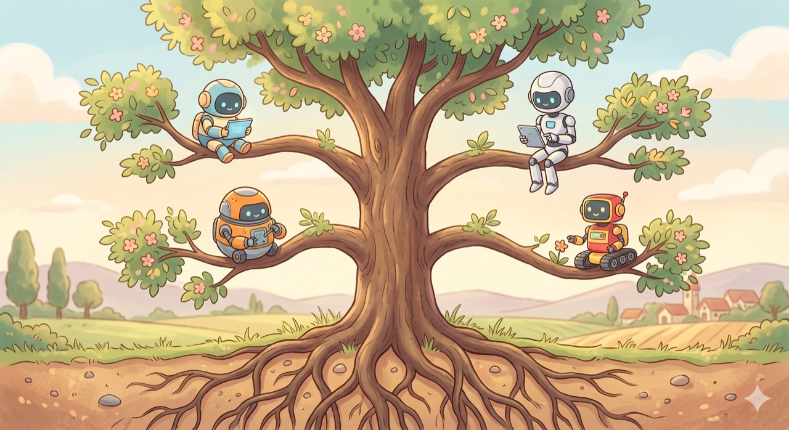

`📍 part6 > 클로드코드의 친척들`

> **이름이 다 달라서 헷갈리지만, 뿌리는 거의 같습니다.** 코워크·코덱스·제미나이 CLI·오픈클로 — 클로드코드와 뭐가 같고 뭐가 다른지, 그리고 *언제 무엇을 꺼내 쓰면 되는지* 한 번에 정리합니다.

---

클로드코드를 좀 쓰다 보면 비슷한 이름들이 자꾸 들려옵니다. "코워크가 더 낫다더라", "회사에선 코덱스 쓴다던데", "제미나이는 공짜라며?", "오픈클로는 또 뭐야?" 종류가 많아 보이지만, 알고 보면 **다 같은 뿌리에서 갈라진 친척들**입니다.

이 글의 목표는 딱 하나예요. **"이게 다 뭐고, 나는 언제 뭘 쓰면 되는가"** 를 머릿속에서 정리하는 것.

---

## 먼저, 공통점부터 — 다 같은 '엔진'을 씁니다

이 친척들의 핵심을 한 문장으로 묶으면 이렇습니다.

> **"똑똑한 AI 모델 + 내 컴퓨터에서 직접 행동하는 능력(파일 읽기·쓰기, 명령 실행, 외부 연결)"**

이 구조를 우리는 part0에서 이미 배웠습니다 — *말로만 답하는 AI*가 아니라 *내 컴퓨터에서 실제로 일을 하는 AI*. 코워크든 코덱스든 제미나이든, 전부 이 똑같은 골격 위에 서 있습니다. 차이는 **(1) 어떤 AI 모델을 쓰는가, (2) 어떤 화면(터미널이냐 앱이냐)에서 만나는가, (3) 누구를 위해 만들어졌는가** — 이 세 가지뿐이에요.

그래서 하나를 제대로 익히면 나머지는 **개념이 거의 그대로 옮겨갑니다.** 이게 이 글에서 가장 기억할 한 가지입니다.

---

## 1. 클로드 코워크 vs 클로드코드 — 같은 회사, 다른 옷

먼저 가장 가까운 친척. 둘 다 **앤트로픽(Anthropic)이 만든 같은 형제**입니다.

### 근본적으로 같은가? → 네, 엔진이 똑같습니다

클로드 **코워크(Cowork)** 는 2026년 1월 미리보기로 등장해 4월 9일 정식 출시된 제품인데, 앤트로픽이 직접 *"클로드코드의 에이전트 방식을 개발자가 아닌 일반 지식노동자에게 그대로 가져온 것"* 이라고 설명합니다. 즉 **클로드코드의 심장을 그대로 떼어다 데스크톱 앱에 옮겨 담은 것**이에요.

### 그럼 뭐가 다른가? → '옷'과 '대상'이 다릅니다

| | **클로드코드** | **클로드 코워크** |
|---|---|---|
| 만나는 화면 | 터미널(까만 화면) | 데스크톱 앱(클릭하는 화면) |
| 주 대상 | 개발자 | 비개발 지식노동자 |
| 잘하는 일 | 코드, 폴더·파일 작업, 자동화 | 문서·데이터·리서치·발표자료 |
| 느낌 | "내 컴퓨터를 다루는 만능 비서" | "내 책상일을 대신 해주는 동료" |

비유하자면, **같은 엔진을 얹은 트럭과 승용차**입니다. 트럭(클로드코드)은 짐 싣고 거친 일 하기 좋고, 승용차(코워크)는 평소 출퇴근에 편하죠. 엔진이 같으니 둘 다 빠르지만, **쓰는 상황이 다릅니다.**

### 그럼 언제 다르게 쓰면 되나?

- **코드·터미널·자동화·개발 작업** → 클로드코드
- **문서 정리·엑셀 분석·자료조사·발표자료** 같은 평범한 사무 업무 → 코워크

지금까지 이 시리즈에서 배운 '비개발 업무 자동화'의 상당수는, 사실 **코워크로도 거의 똑같이** 할 수 있습니다. 터미널이 끝내 불편하다면 코워크가 더 편한 입구일 수 있어요.

### 검증: "PPT는 코워크가 더 잘한다" — 맞습니다 ✅

직접 써본 분들이 자주 하는 말이고, 실제로도 근거가 있습니다.

- **코워크**는 작업을 끝내면 **`.pptx` 파일을 통째로** 책상(파일 시스템)에 저장합니다. 실제 내용, 데이터, **발표자 노트까지** 채워진 구조화된 발표 자료를요. 데스크톱 앱이라 파워포인트 같은 프로그램과도 맞물려 돌아갑니다.
- **클로드코드**도 슬라이드를 *만들긴* 합니다. 하지만 테스트에서 **슬라이드 마스터·테마·색상 팔레트 같은 '템플릿의 뼈대'는 건드리지 못하는** 한계가 보고됐어요. 별도 도구(브랜드 키트 MCP 등)를 붙이면 나아지지만, 기본 상태로는 약합니다.

**왜 그럴까?** 근본 엔진은 같지만, **태어난 목적이 다르기 때문**입니다. 코워크는 처음부터 "보고서·발표자료 같은 *완성형 결과물*을 내놓는 것"을 겨냥했고, 클로드코드는 "코드와 파일을 다루는 것"에 최적화돼 있어요. PPT는 시각적 결과물이라, 데스크톱·앱 친화적인 코워크 쪽이 자연스럽게 유리합니다.

> **정리: PPT·발표자료처럼 '보여주는 결과물'은 코워크, 코드·파일·자동화는 클로드코드.** 엔진이 같으니 둘 다 못하진 않지만, *결이 맞는 쪽*이 분명히 있습니다.

---

## 2. 클로드코드 vs 코덱스 vs 제미나이CLI

이번엔 **다른 회사들이 만든 같은 종류**의 도구들입니다. 

세 줄로 정리하면:

- **클로드코드** — 앤트로픽. 클로드 모델 기반.
- **코덱스(Codex CLI)** — 오픈AI. 챗GPT를 만든 그 회사. GPT 모델 기반.
- **제미나이 CLI** — 구글. 제미나이 모델 기반.

### 근본적으로 같은가? → 네, 같은 '종족'입니다

셋 다 **터미널에서 돌아가는 AI 코딩 비서**로, 구조가 판박이입니다. *AI 모델 + 파일 읽고 쓰기 + 명령 실행 + 외부 연결(MCP)* — 1번에서 말한 그 골격 그대로예요. 그래서 **하나를 익히면 나머지도 며칠이면 적응**합니다.

차이는 성격입니다(2026년 기준):

| | 한 줄 성격 | 특징 |
|---|---|---|
| **클로드코드** | 가장 깊이 생각하는 우등생 | 복잡한 다중 파일 작업·코드 리뷰에 강함, 결과 신뢰도 높음 |
| **코덱스** | 안전을 챙기는 신중파 | 작업을 격리된 상자(컨테이너) 안에서 실행, **오픈소스(무료 공개)**, 챗GPT 생태계 |
| **제미나이 CLI** | 가성비·대용량 담당 | 넉넉한 무료 한도, 방대한 분량을 한 번에 읽음, 구글 서비스 연동 |

> ⏰ **타이밍 있는 소식**: 구글은 **개인용 제미나이 CLI 무료 제공을 2026년 6월 18일자로 종료**하고, 후속작인 **'안티그래비티 CLI(Antigravity CLI)'** 로 넘깁니다. "제미나이 버전"을 찾고 있었다면, 앞으로는 이 이름으로 불릴 가능성이 큽니다.

실제로 많은 사람들이 **제미나이로 큰 코드를 훑어 파악하고, 마무리 구현은 클로드코드로** 하는 식으로 *섞어* 씁니다. 경쟁자라기보다 **연장통 속 서로 다른 공구**에 가깝죠.

### 플랫폼을 교체할 땐 어떻게? → 생각보다 쉽습니다

"클로드코드 열심히 길들여놨는데, 회사가 코덱스를 쓰래…" — 걱정 안 해도 됩니다. 업계가 **공용 규격**으로 수렴하고 있어서요.

1. **규칙 파일 → `AGENTS.md` 라는 공용 표준이 생겼습니다.**
   우리가 part4에서 배운 `CLAUDE.md`(내 규칙을 기억시키는 파일) 기억하시죠? 이걸 **어느 도구든 읽는 공통 파일명 `AGENTS.md`** 로 두는 흐름이 표준이 됐습니다(리눅스 재단이 관리, 6만 개 이상 프로젝트가 채택). 여러 도구를 같이 쓴다면 **`AGENTS.md`를 기본으로 두고**, 클로드 전용 지시만 `CLAUDE.md`에 따로 두면 됩니다.

2. **외부 연결(MCP) → 설정이 거의 동일합니다.**
   part4에서 본 MCP(캘린더·노션 등 연결) 설정은 **거의 모든 도구가 똑같은 형식**을 씁니다. 그대로 복사-붙여넣기 수준이에요(코덱스만 표기법이 살짝 다른 정도).

3. **스킬·단축명령 → 옮겨집니다.**
   요즘은 한 곳에 규칙·MCP·스킬을 모아두고 **여러 도구로 자동 동기화**해주는 보조 도구(예: `CC Switch`, `.agents` 동기화)도 있습니다.

> **핵심: 플랫폼 교체 비용이 '몇 주'에서 '몇 시간'으로 줄었습니다.** 규칙은 `AGENTS.md`, 연결은 MCP — 이 두 가지만 챙기면 갈아타기는 어렵지 않아요. *당신이 쌓은 노하우는 특정 회사 제품이 아니라, 옮겨다닐 수 있는 자산입니다.*

---

## 3. 오픈클로(OpenClaw)는 무엇인가

마지막 친척은 결이 조금 다릅니다. 앞의 도구들이 *회사 제품*이라면, **오픈클로는 무료·오픈소스 프로젝트**예요. 🦞

### 한마디로: "어떤 AI든 끼워 쓰는, 내 컴퓨터의 자율 비서"

- **무료·오픈소스**이고, **내 컴퓨터에서 직접** 돌아갑니다.
- 특정 회사에 묶이지 않아요. **클로드·GPT·제미나이·딥시크·그록·완전 로컬 모델**까지, 원하는 두뇌를 골라 끼웁니다. (그래서 앞의 셋과 달리 '엔진을 갈아 끼울 수 있는' 비서)
- 파일·터미널·브라우저는 물론, **카톡 같은 메신저 50여 종**(텔레그램·디스코드·슬랙·아이메시지 등)에 붙습니다.

### 무엇이 특별한가? → '자율성'

가장 큰 차이는 **시키지 않아도 스스로 움직인다**는 점입니다. 오픈클로는 **30분마다 할 일이 있는지 스스로 확인**하고 알아서 처리하며, **세션이 바뀌어도 기억을 유지**합니다. 우리가 part4에서 배운 '예약·자동 실행'을 훨씬 더 밀어붙인 형태라고 보면 됩니다. 코딩이 필요하면 **채팅 한 줄로 코딩 세션을 열어** 격리된 작업공간에서 작업하고, 끝나면 합치거나 검토를 받는 기능도 있어요.

### 알아두면 좋은 뒷이야기

이름이 헷갈릴 만합니다. **2025년 11월 'Clawdbot'으로 태어나 → 2026년 1월 'Moltbot' → 다시 'OpenClaw'** 로, 두 달 새 세 번이나 개명한 화제의 프로젝트거든요. 그래서 자료마다 옛 이름이 섞여 있을 수 있습니다.

> **정리: 오픈클로 = 회사에 묶이지 않고, 두뇌(AI 모델)를 골라 끼우며, 메신저로 부리고, 스스로 알아서 일하는 오픈소스 자율 비서.** 클로드코드보다 '자유도'와 '자율성'이 높은 대신, 직접 설치·관리할 손품이 더 듭니다.

---

## 한 장으로 정리

| 이름 | 누가 만들었나 | 어디서 | 누구를 위해 / 언제 쓰나 |
|---|---|---|---|
| **클로드코드** | 앤트로픽 | 터미널 | 개발·코드·파일 자동화 |
| **클로드 코워크** | 앤트로픽 | 데스크톱 앱 | 문서·데이터·**PPT** 등 사무 업무 |
| **코덱스** | 오픈AI | 터미널 | 안전한 격리 실행·오픈소스 선호 |
| **제미나이 CLI**(→안티그래비티) | 구글 | 터미널 | 무료·대용량 코드 훑기 |
| **오픈클로** | 오픈소스 커뮤니티 | 내 컴퓨터(자율) | 모델 자유 선택·메신저·자동 실행 |

세부 기능은 계속 바뀌지만, **뿌리가 같다는 사실은 안 바뀝니다.** 그래서 이 시리즈에서 익힌 감각 — *작업 폴더, 좋은 요청, 권한과 안전, 규칙(CLAUDE.md), 스킬, MCP* — 은 **어느 도구로 옮겨가도 그대로 통합니다.**

> **결론: 도구 이름에 휘둘리지 마세요. 하나(클로드코드)를 제대로 익히면, 나머지는 '갈아입는 옷'일 뿐입니다.** 상황에 맞는 옷을 고르는 안목 — 그게 이 글에서 가져갈 진짜 실력입니다.

---

◀ 이전 [내 클로드 다듬기](part6-1.내-클로드-다듬기) · [📑 목차](0.목차)
