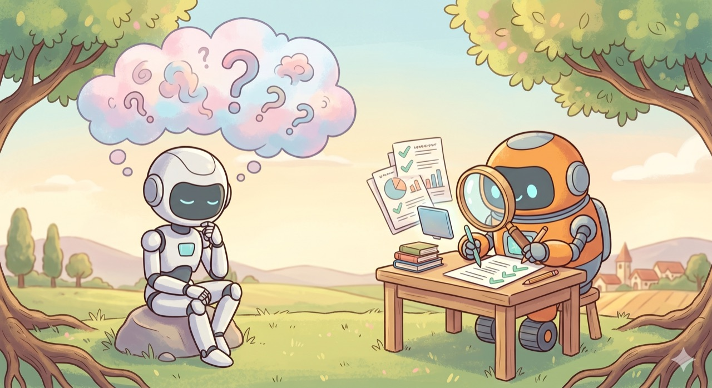

`📍 part6 > 클로드코드는 왜 덜 틀릴까`

> **먼저 솔직하게: 클로드코드도 환각을 합니다.** 모든 AI가 그래요. 그런데 왜 클로드코드는 *덜 틀리는 것처럼* 느껴질까요? 비밀은 '더 똑똑한 머리'가 아니라, **틀린 걸 스스로 잡아내고 고치는 구조**에 있습니다.

---

"AI가 또 그럴듯하게 거짓말하네." 챗봇을 써본 사람이라면 한 번쯤 겪는 일입니다. 없는 책 제목을 지어내고, 틀린 숫자를 자신만만하게 말하죠. 이걸 **환각(hallucination)** 이라고 부릅니다.

그런데 클로드코드로 일을 시켜보면 인상이 좀 다릅니다. "얘는 좀 더 믿을 만한데?" 싶죠. 흔히들 *"클로드코드가 더 똑똑해서"* 라고 생각하는데 — **절반만 맞는 말**입니다. 진짜 이유는 따로 있어요. 이 글에서 그 구조를 파헤쳐 봅니다.

> ⚠️ **먼저 오해 하나 바로잡기**: "클로드코드는 환각을 안 한다"는 말은 **사실이 아닙니다.** 클로드코드도 똑같은 AI 모델 위에서 돌아가니 환각을 합니다. 다만 그 환각이 *최종 결과물까지 살아남기 어려운* 구조라서, 결과적으로 덜 틀려 보이는 거예요. 이 차이가 이 글의 전부입니다.



---

## 1. 환각은 왜 생길까 — AI의 근본적인 한계

먼저 "왜 AI가 거짓말을 하는가"부터요. 못된 게 아니라, **만들어진 방식 자체** 때문입니다.

### AI는 '다음에 올 그럴듯한 단어'를 이어붙이는 기계

AI 언어모델의 본질은 의외로 단순합니다. *"지금까지의 말 다음에 올, 가장 그럴듯한 단어"* 를 계속 이어붙이는 거예요. **'사실인지'가 아니라 '그럴듯한지'를 기준으로** 말을 만듭니다.

문제는 여기서 시작됩니다. AI는 학습할 때 **매끄러운 문장들만** 잔뜩 봅니다 — "이건 참, 저건 거짓" 같은 꼬리표는 거의 없이요. 그래서 *진짜 사실*과 *그럴듯한 가짜*를 구분하는 감각이 애초에 약합니다. 생일, 논문 제목, 특정 수치처럼 **패턴으로 추측할 수 없는 정보**일수록 더 그래요. 모르면 "모른다" 해야 하는데, 그럴듯한 답을 *지어내* 버립니다.

### 게다가, AI는 '찍기'에 길들여졌습니다

2025년 발표된 연구(["Why Language Models Hallucinate", OpenAI](https://openai.com/index/why-language-models-hallucinate/))가 흥미로운 진단을 내놨습니다. **AI를 평가하는 방식이 거짓말을 부추긴다**는 거예요.

시험을 떠올려 보세요. 빈칸으로 두면 0점, **찍어서라도 쓰면 맞을 확률**이 있다면? 누구나 찍습니다. AI 평가도 그동안 "정답률"만 따졌기 때문에, AI는 **"모르겠어요"라고 솔직히 말하기보다 자신 있게 찍는 쪽**으로 훈련돼 버렸습니다. 겸손이 손해를 보고, 허세가 점수를 받은 거죠.

> **요약: 환각은 버그가 아니라, AI가 태어난 방식의 부산물입니다.** ① 사실이 아니라 '그럴듯함'으로 말하고, ② 모를 때 입을 다무는 대신 찍도록 길들여졌다 — 이 두 가지 때문이에요. 그래서 *어떤 AI든* 환각은 합니다.

---

## 2. 그럼 왜 클로드코드는 '덜' 틀릴까

여기서 핵심 전환입니다. 환각이 AI의 본성이라면, 클로드코드는 그걸 **어떻게 다스릴까요?**

### 채팅 AI는 '머릿속'으로만, 클로드코드는 '현실'을 확인하며

차이는 모델의 IQ가 아니라 **일하는 환경**에 있습니다.

- **챗GPT·클로드 앱(채팅)**: 질문을 받으면 *머릿속 기억만으로* 답합니다. 틀린 기억이 있어도 확인할 길이 없으니, **환각이 그대로 최종 답**이 됩니다.
- **클로드코드**: 답하기 전에 **실제로 확인**합니다. 파일이 궁금하면 *열어서 읽고*, 명령이 되는지 궁금하면 *실행해 보고*, 결과가 맞는지 궁금하면 *테스트를 돌려* 봅니다.

우리가 part0에서 배운 그 차이 — *말로만 답하는 AI* vs *내 컴퓨터에서 직접 행동하는 AI* — 가 바로 환각을 가르는 분수령입니다. 클로드코드는 **추측 대신 대조**를 할 수 있어요.

> 핵심을 한 줄로: 클로드코드는 *"내 생각엔 이래"* 가 아니라 *"확인해 보니 이렇더라"* 라고 말합니다. **'현실에 발을 딛는 것'(grounding)** — 이게 환각을 누르는 가장 강력한 장치입니다.

그래서 "더 똑똑해서"는 절반만 맞습니다. 강력한 모델인 것도 사실이지만, **진짜 차이는 '확인할 수단이 손에 있다'**는 점이에요. 아무리 똑똑한 사람도 기억에만 의존하면 틀리고, 평범해도 계산기를 두드리면 정확하니까요.

---

## 3. 스스로 '채점 기준'을 만든다 — 검증을 계획에 넣는 과정

클로드코드의 더 영리한 점은, **시키지 않아도 검증 단계를 일의 계획에 끼워 넣는다**는 것입니다.

복잡한 일을 받으면 클로드코드는 보통 이렇게 움직입니다.

1. **계획 세우기** — 무엇을, 어떤 순서로 할지 정합니다.
2. **여기서 핵심** — 계획 안에 **"끝나면 이렇게 확인한다"는 검증 단계를 함께** 넣습니다.
   - 예: *"파일을 고친 뒤 → 다시 열어 읽어 의도대로 바뀌었는지 확인"*, *"코드를 만든 뒤 → 테스트를 돌려 통과하는지 확인"*, *"숫자를 뽑은 뒤 → 실제 데이터와 대조"*
3. **실행 → 검증** — 작업하고, 자기가 세운 그 기준으로 **스스로 채점**합니다.

말하자면 **답안을 쓰고 끝내는 게 아니라, 채점 기준표를 먼저 만들어 두고 자기 답을 대조**하는 셈입니다. 이 '객관적인 통과/실패 기준'이 있으면, 환각이 슬쩍 끼어들어도 **검증 단계에서 딱 걸립니다.** 자기 생각이 아니라 *실제 실행 결과*가 판정하니까요.

> 💡 이건 우리가 part2-3 [결과 확인하고 다시 시키기](part2-3.결과-확인하고-다시-시키기)에서 *사람이* 하던 일을, 클로드코드가 *스스로* 하는 것에 가깝습니다.

---

## 4. 틀리면 다시 — 반복이 완성도를 끌어올린다

검증에서 **실패하면 어떻게 될까요?** 여기가 마지막 열쇠입니다.

클로드코드는 검증에 실패하면 **그 자리에서 멈추지 않고, 무엇이 틀렸는지를 단서 삼아 다시 작업**합니다. 그리고 또 검증하고, 또 실패하면 또 고치고 — **통과할 때까지 이 고리를 돕니다.**

```
계획 → 실행 → 검증 → (실패) → 원인 파악 → 다시 실행 → 검증 → (통과!) → 끝
```

이 반복 고리의 효과가 큽니다. 한 연구 정리에 따르면, 이런 **"생성→테스트→실패→개선" 루프는 한 번의 환각을 '고칠 수 있는 중간 상태'로 바꿔** 놓습니다([Ralphable](https://ralphable.com/blog/claude-code-hallucination-problem-atomic-skills-reliable-output)). 무슨 뜻이냐면 —

- **채팅 AI**: 환각 = *최종 답*. 틀린 채로 당신에게 전달됨. 😟
- **클로드코드**: 환각 = *중간에 걸러지는 실패*. 통과해야 끝나니, 틀린 건 도중에 솎아짐. 🙂

그래서 결과물의 완성도가 올라갑니다. **틀리지 않아서가 아니라, 틀린 걸 끝까지 안고 가지 않기 때문**이에요.

> **세 줄 정리**
> - 클로드코드도 환각을 *한다.* (AI의 본성)
> - 하지만 **현실을 확인**하고(grounding), **검증을 계획에 넣고**, **실패하면 통과할 때까지 고친다.**
> - 그래서 환각이 *최종 결과까지 살아남기 어렵다* → 덜 틀려 보인다.

---

## 비개발자도 이 원리를 '써먹는' 법

이 구조는 클로드코드가 알아서도 하지만, **당신이 한마디 보태면 훨씬 강해집니다.** 요청에 *검증까지* 시키는 습관을 들이세요.

- ❌ "이 자료 요약해줘"
- ✅ "이 자료 요약하고, **원문이랑 대조해서 내가 안 쓴 내용이 들어갔는지 확인해줘.** 틀린 게 있으면 고쳐서 다시 줘."

- ❌ "이 엑셀 합계 내줘"
- ✅ "합계 내고, **몇 개 행을 직접 다시 더해서 맞는지 검산해줘.**"

핵심은 **"확인해줘", "검산해줘", "틀리면 다시 해줘"** 한마디입니다. 이 한마디가 AI의 '찍기 본능'에 제동을 걸고, 위에서 본 검증 루프를 *당신 일에도* 작동시킵니다.

> **결론: 클로드코드를 믿을 만하게 만드는 건 '완벽한 AI'가 아니라 '확인하는 습관'입니다.** 도구가 그 습관을 절반쯤 갖고 있고, 나머지 절반은 당신이 "확인해줘" 한마디로 채울 수 있어요. 환각은 못 막아도, *걸러낼 수는* 있습니다.

---

<sub>◀ 이전 [클로드코드의 친척들](part6-2.클로드코드의-친척들) · [📑 목차](0.목차)</sub>
